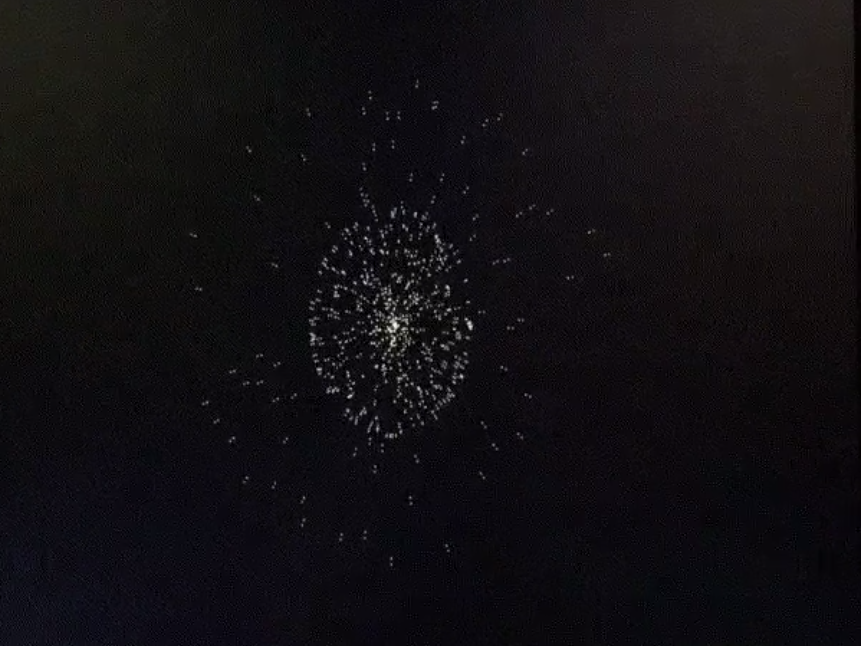

# N-Body
This repository links to my FPGA acceleration project of classic N-Body problem.

This project was executed on Xilinx Ultra 96 FPGA. 

8 high speed parallel accelerators, timing closed at 200MHz. Step by step instructions to reproduce the results are given in the website linked before

Vectorized Python (numpy) based model was used to conceptualize the design before the accelerator was implemented on FPGA.

## Hackster.io link
[Link to open sourced implementation](https://www.hackster.io/rajeev-patwari-ultra96-2019/ultra96-fpga-accelerated-parallel-n-particle-gravity-sim-87f45e)

## Tools used
* Xilinx Vivado
* Pynq (Python on Zynq)
* Verilog 2001 (All floating point operations and data transformation algorithms are imeplemented using Verilog)

